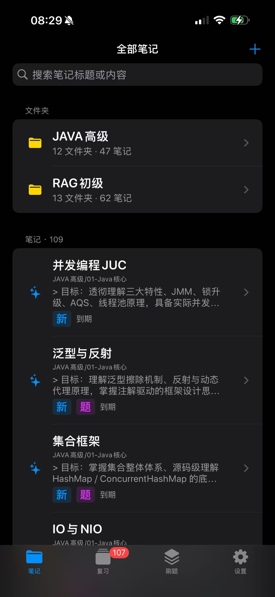
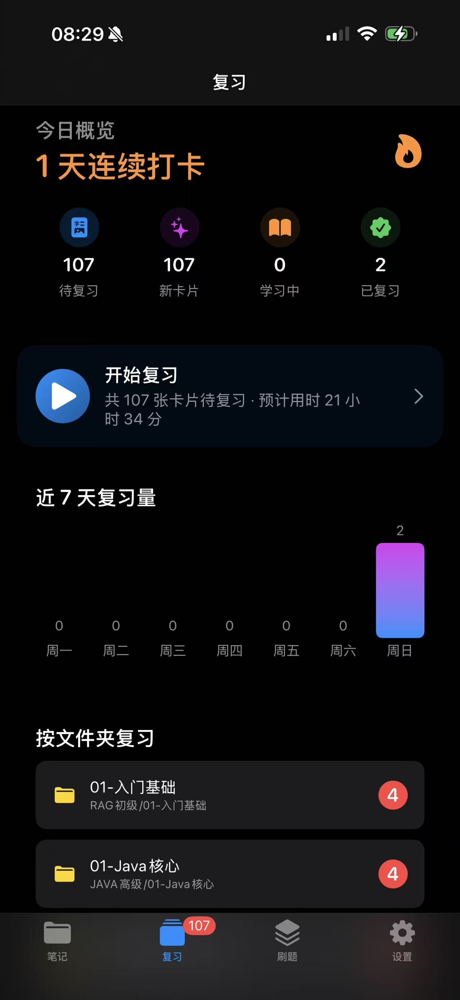
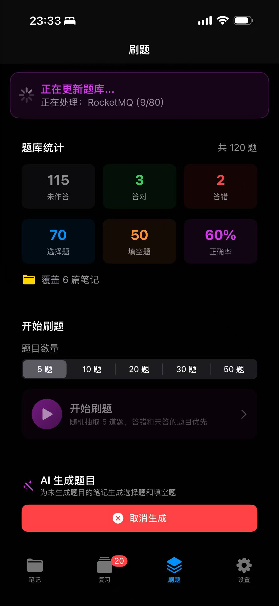
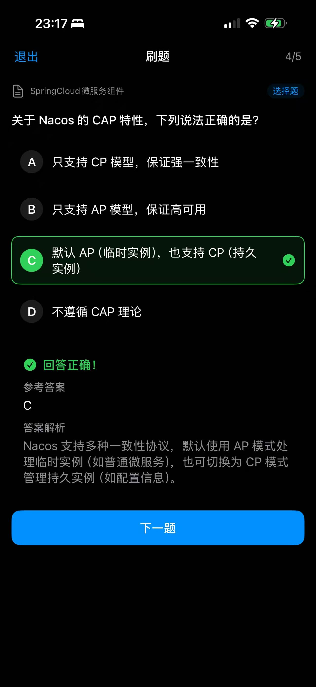

# AnkiNotes - 基于笔记的间隔重复记忆应用

> 把你的 Markdown 笔记变成可复习、可刷题的知识卡片，用 AI 自动生成题目，用间隔重复算法对抗遗忘。


---

## 📱 应用截图

<table>
  <tr>
    <td align="center">
      
      <br><sub>笔记管理</sub>
    </td>
    <td align="center">
      
      <br><sub>间隔复习</sub>
    </td>
    <td align="center">
      
      <br><sub>刷题系统</sub>
    </td>
    <td align="center">
      
      <br><sub>做题体验</sub>
    </td>
  </tr>
</table>

---

## ✨ 核心特性

### 📝 笔记管理
- 多级文件夹管理，递归统计笔记数量
- 原生 Markdown 渲染，支持表格、代码块等格式
- 智能搜索：实时下拉建议，高亮匹配字符
- 笔记状态标识："新"标识 + "题"标识（已生成题目）
- 无限滚动加载，默认 10 条，下滑自动加载更多

### ☁️ WebDAV 云端同步
- 标准 WebDAV 协议，兼容坚果云、Nextcloud、群晖等
- 双向同步：新增/修改/删除均同步到云端
- 保持云端文件夹结构，按目录整理笔记
- 每次打开应用后台自动静默同步
- 编辑前单独同步该笔记，减少冲突概率
- 同步操作加锁，防止重复执行

### 🧠 间隔重复复习
- 基于 SM-2 的间隔重复算法，智能调整复习间隔
- 四级评级：极难 / 困难 / 良好 / 简单，最小间隔 1 天
- **做题测评评级**：已生成题目的笔记可通过做题自动评估掌握程度
- 按笔记字数智能估算复习用时
- 按文件夹复习，针对性学习
- 今日概览 + 连续打卡，激励坚持

### 🤖 AI 题库生成
- 接入阿里云百炼平台，支持自定义 API Key 和模型
- 按笔记内容自动生成选择题和填空题，覆盖所有知识点
- **SSE 流式生成**：边生成边显示进度，不再超时
- 逐篇保存：每完成一篇立即保存，意外中断不丢失
- 可中途取消，不影响已生成题目
- 生成失败时弹出具体错误原因

### 🎯 刷题系统
- 智能选题算法：错题和未做题优先，做对的题概率更低
- 题库统计：未作答 / 答对 / 答错 / 正确率 全方位统计
- 支持 5 / 10 / 20 / 30 / 50 题自选
- 每题提供参考答案和详细解析
- 下拉刷新题库统计

---

## 🚀 快速开始

### 安装方式

**方式一：GitHub Actions 自动编译 IPA（推荐）**

1. Fork 本仓库
2. 配置代码签名 Secrets（详见下方配置说明）
3. 推送代码触发自动编译（commit 包含 `[build-ipa]`）
4. 下载 Actions 中的 `AnkiNotes-Device-IPA` Artifact
5. 用 [SideStore](https://sidestore.io/) 或 [AltStore](https://altstore.io/) 侧载到 iPhone

**方式二：本地编译**

```bash
git clone https://github.com/Han03/AnkiNotes.git
cd AnkiNotes
open AnkiNotes.xcodeproj
# 在 Xcode 中配置签名 → 连接 iPhone → 点击运行
```

> 环境要求：macOS 13+ / Xcode 15+ / iOS 16.0+

### 配置说明

**WebDAV 同步（以坚果云为例）**

1. 登录[坚果云](https://www.jianguoyun.com/) → 账户信息 → 安全选项
2. 第三方应用管理 → 添加应用 → 生成密码
3. App 设置 → WebDAV 同步，填写：
   - 服务地址：`https://dav.jianguoyun.com/dav/`
   - 用户名：坚果云账号邮箱
   - 密码：刚才生成的第三方应用密码
   - 远端根目录：`/AnkiNotes`

**百炼大模型**

1. 登录[阿里云百炼平台](https://bailian.console.aliyun.com/) → 创建 API Key
2. App 设置 → 大模型题库设置，填写 API Key 和模型编码（如 `qwen-turbo`）
3. 进入刷题菜单 → 生成题目，AI 自动为所有笔记生成题目

---

## 🛠️ 技术栈

| 类别 | 技术 |
|------|------|
| 语言 | Swift 5.9 |
| UI 框架 | SwiftUI |
| 最低系统 | iOS 16.0 |
| 数据存储 | JSON 文件 + 本地缓存 |
| 云端同步 | WebDAV 协议 |
| AI 接口 | 阿里云百炼 API（OpenAI 兼容，SSE 流式） |
| 记忆算法 | SM-2 间隔重复算法 |
| CI/CD | GitHub Actions（自动编译 IPA） |

---

## 📁 项目结构

```
AnkiNotes/
├── Models/                    # 数据模型
│   ├── Note.swift             # 笔记
│   ├── Folder.swift           # 文件夹
│   ├── Question.swift         # 题目
│   └── SRSData.swift          # SRS 记忆数据
├── Views/                     # 界面
│   ├── FolderBrowserView.swift   # 笔记浏览
│   ├── NoteDetailView.swift      # 笔记详情
│   ├── ReviewHomeView.swift      # 复习主页
│   ├── ReviewSessionView.swift   # 复习会话
│   ├── ReviewQuizView.swift      # 做题测评
│   ├── QuizHomeView.swift        # 刷题主页
│   ├── QuizSessionView.swift     # 刷题会话
│   └── SettingsView.swift        # 设置
├── Services/                  # 业务逻辑
│   ├── StorageService.swift      # 本地存储
│   ├── WebDAVService.swift       # WebDAV 同步
│   ├── SchedulerService.swift    # SRS 调度算法
│   └── QuizService.swift         # 题库生成与管理
├── Assets.xcassets/           # 资源文件
├── Screenshot/                # 应用截图
├── .github/workflows/         # GitHub Actions
│   └── build-ipa.yml          # IPA 自动编译
└── AnkiNotesApp.swift         # 应用入口
```

---

## 📊 记忆算法

基于 **SM-2** 间隔重复算法，根据掌握程度自动调整复习间隔。

| 评级 | 首次复习 | 说明 |
|------|----------|------|
| 极难 | 1 天 | 完全没掌握，间隔增长缓慢 |
| 困难 | 1 天 | 勉强记得，间隔正常增长 |
| 良好 | 1 天 | 基本掌握，间隔较快增长 |
| 简单 | 4 天 | 完全掌握，间隔快速增长 |

> 最小复习间隔 1 天，避免当天重复看同一篇长笔记。

**做题测评**：已生成题目的笔记可通过做题自动评级——正确率 ≥90% 简单，70-89% 良好，40-69% 困难，<40% 极难。

---

## 🤝 贡献

欢迎提交 Issue 和 Pull Request！

1. Fork 本仓库
2. 创建特性分支 (`git checkout -b feature/AmazingFeature`)
3. 提交更改 (`git commit -m 'Add some AmazingFeature'`)
4. 推送到分支 (`git push origin feature/AmazingFeature`)
5. 开启 Pull Request

---

## 📄 许可证

本项目采用 MIT 许可证 - 详见 [LICENSE](LICENSE) 文件。
